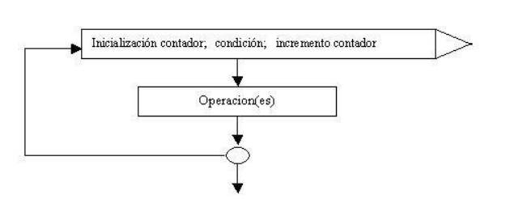

## Que son las estructuras repetitivas?


### Cadena de caracteres. Clase String.

Es un objeto en java que nos permite trabajar con cadena de caracteres, palabras, oraciones. La clase string tiene herramientas que nos ayudan a hacer las cosas mas sencillas. Por ejemplo: encontrar cuantos caracteres tiene un string.Cuando se define una variable String, se crea una instancia de la clase String.

```java Declaracion y asignacion de una cadena de caracteres
String nombre = "Day";
```

:::info Strings
Los String siempre van con comillas dobles "
:::

:::info 
En Java no se puede utilizar el operador relacionar == para verificar si dos String son iguales.
:::

:::info
Los objetos como String se almacenan en el heap de memoria. Cuando asignas una cadena de caracteres a una variable String, Java crea un objeto String en el heap y la variable simplemente hace referencia a esa ubicación en memoria.
:::

### While
Bucle que ejecuta un bloque de codigo repetidamente mientras una condicion especificada sea verdadera. Se evalua antes de cada iteración.

```java
while (condición) {
    // Código a ejecutar mientras la condición sea verdadera
}
```

Después de cada iteración, la condición se vuelve a evaluar. Si la condición es falsa, la ejecución del bucle while se detiene y el control pasa a la siguiente instrucción después del bucle.

```java
public class EjemploWhile {
    public static void main(String[] args) {
        int i = 1;
        while (i <= 5) {
            System.out.println(i);
            i++;
        }
    }
}

```
### Do while
Se ejecuta su bloque de codigo al menos una vez. La condición de la estructura está abajo del bloque a repetir, a diferencia del while que está en la parte superior.


```java
import java.util.Scanner;

public class Clase2 {
	public static void main(String[] ar) {
		Scanner teclado = new Scanner(System.in);
		int suma, cant, valor, promedio;
		suma = 0;
		cant = 0;
		do {
			System.out.print("Ingrese un valor (0 para finalizar):");
			valor = teclado.nextInt();
			if (valor != 0) {
				suma = suma + valor;
				cant++;
			}
		} while (valor != 0);
		if (cant != 0) {
			promedio = suma / cant;
			System.out.print("El promedio de los valores ingresados es:");
			System.out.print(promedio);
		} else {
			System.out.print("No se ingresaron valores.");
		}
	}
}
```

### For
En general, la estructura for se usa en aquellas situaciones en las cuales CONOCEMOS la cantidad de veces que queremos que se ejecute el bloque de instrucciones. 




En su forma más típica y básica, esta estructura requiere una variable entera que cumple la función de un CONTADOR de vueltas. En la sección indicada como "inicialización contador", se suele colocar el nombre de la variable que hará de contador, asignándole a dicha variable un valor inicial. En la sección de "condición" se coloca la condición que deberá ser verdadera para que el ciclo continúe (en caso de un falso, el ciclo se detendrá). Y finalmente, en la sección de "incremento contador" se coloca una instrucción que permite modificar el valor de la variable que hace de contador (para permitir que alguna vez la condición sea falsa)

Ejemplo: imprime en pantalla los números del 1 al 100. 

```java
public class Clase1 {
	public static void main(String[] ar) {
		for (int f = 1; f <= 100; f++) {
			System.out.print(f);
			System.out.print("-");
		}
	}
}
```