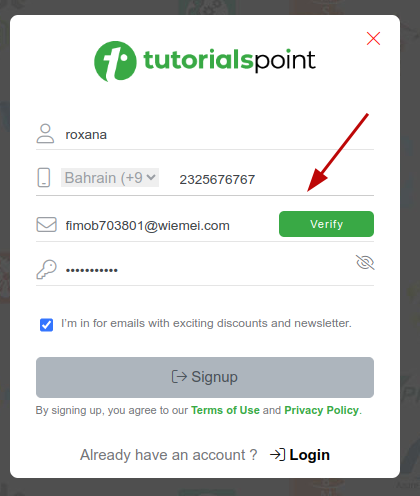
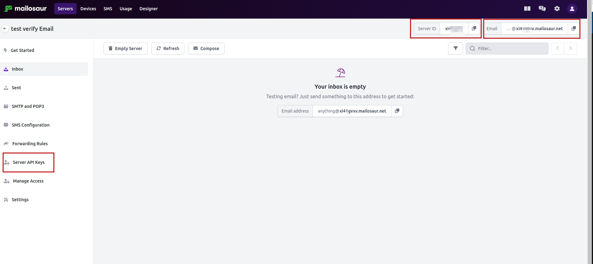

Hace poco me cruce con una prueba técnica donde tenia que verificar un código para crear una cuenta.

Encontre la opcion [Mailosaur](https://mailosaur.com/)

## Cómo empezar
Lo primero que hice fue armar los pasos donde el usuario ingresaria los datos del usuario para crear una cuenta.
1. **Click click, hasta enviar el boton de verificar código**

```jsx
it('Send confirmation code', () =>{
    cy.get(#name).type(faker.person.firstName());
    cy.setRandomCountry();
    cy.get(#phone).type(faker.phone.number());
    cy.get(#email).type(email);
    cy.get(#pass).type(faker.internet.password({ length: 20 }));
    cy.get(#verifyEmailBtn).should("be.visible").click();
})
```
**En mi caso use la libreria [faker](https://fakerjs.dev/) para generar datos random, y realistas** 




2. **Configurar mailosaur**

- Instalar mailosaur
```
npm install cypress-mailosaur --save-dev
```

- Agregar el command 
En commands.js
```jsx title="support/commands.js"
import 'cypress-mailosaur'
```
- Ir al dashboard de mailosaur
    - Crear nuevo server "Create server"
    - Colocarle un nombre "verify Email"
    - Copiar API KEY



- Clocar la api key en cypress.json
Crear nuevas variables de ambiente. 
```jsx title="cypress.json"
{
    "env": {
        "MAILOSAUR_API_KEY": "YuPrde3zNvANPkZ"
    }
}
```
- Crear el test
* El serverId y sevrver DOman sacarlo desde el dashboard de dmailosaur.

3. **Se envia el email... ¡A capturarlo!**

```jsx
const serverId = 'xi8797'
const serverDomain= '@xi8797.mailosaur.net'
const email = 'password-reset@' + serverDomain

it('Send confirmation code', () =>{
    cy.visit('https://')
    cy.get(#name).type(faker.person.firstName());
    cy.setRandomCountry();
    cy.get(#phone).type(faker.phone.number());
    cy.get(#email).type(email);
    cy.get(#pass).type(faker.internet.password({ length: 20 }));
    cy.get(#verifyEmailBtn).should("be.visible").click();

    cy.mailosaurGetMessage(serverId,{
        sentTo: email
    }).then((message) => {
     // Obtener el código OTP del correo electrónico usando expresión regular
        const otpCodeMatch =
          /<p.*?style=".*?background:#5bac3a;.*?font-size:24px;.*?letter-spacing:4px;">(.*?)<\/p>/.exec(
            message.html.body
          );
        if (otpCodeMatch && otpCodeMatch.length >= 2) {
          const otpCode = otpCodeMatch[1];
          return otpCode;
        } else {
          return null;
        }
    });
});
```

*En mi caso tuve que usar una expresion regular porque el codigo no era un link, lo guarde y lo retorne. 


Este es mi [repo original](https://github.com/dbquiroga/cy_tutorialspoint), en realidad use cucumber y POM, pero la idea es masomenos la misma, cualquier duda porfa escibime en Discord Uusername: dbquiroga. 


