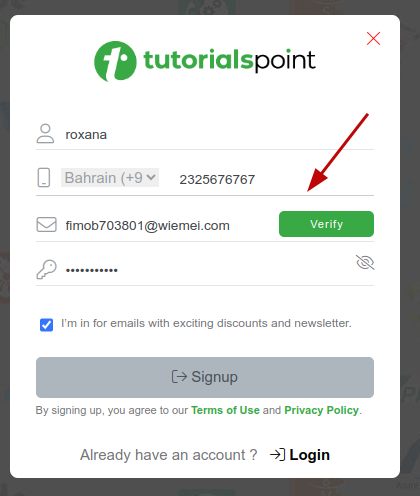
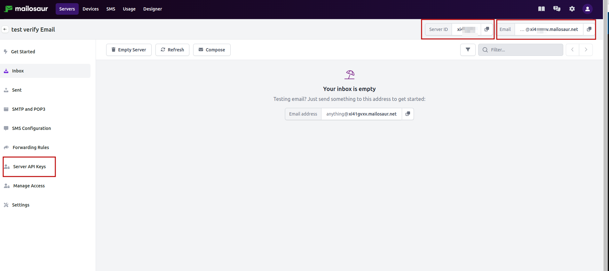

Hace poco me crucé con una prueba técnica donde tenía que verificar un código para crear una cuenta.

Encontré la opción [Mailosaur](https://mailosaur.com/)

## Cómo empezar
Lo primero que hice fue armar los pasos donde el usuario ingresaría los datos para crear una cuenta.

1. **Click click, hasta enviar el botón de verificar código**

```jsx
it('Send confirmation code', () => {
    cy.get('#name').type(faker.person.firstName());
    cy.setRandomCountry();
    cy.get('#phone').type(faker.phone.number());
    cy.get('#email').type(email);
    cy.get('#pass').type(faker.internet.password({ length: 20 }));
    cy.get('#verifyEmailBtn').should("be.visible").click();
})
```
**En mi caso usé la librería [faker](https://fakerjs.dev/) para generar datos random y realistas.**




2. **Configurar Mailosaur**

- Instalar mailosaur
```
npm install cypress-mailosaur --save-dev
```

- Agregar el command en commands.js
```jsx title="support/commands.js"
import 'cypress-mailosaur'
```
- Ir al dashboard de Mailosaur
    - Crear nuevo server: "Create server"
    - Colocarle un nombre: "verify Email"
    - Copiar API KEY



- Colocar la API key en cypress.json
Crear nuevas variables de ambiente.
```jsx title="cypress.json"
{
    "env": {
        "MAILOSAUR_API_KEY": "YuPrde3zNvANPkZ"
    }
}
```
- Crear el test
* El `serverId` y `serverDomain` sacarlos desde el dashboard de Mailosaur.

3. **Se envía el email... ¡A capturarlo!**

```jsx
const serverId = 'xi8797'
const serverDomain = '@xi8797.mailosaur.net'
const email = 'password-reset@' + serverDomain

it('Send confirmation code', () => {
    cy.visit('https://')
    cy.get('#name').type(faker.person.firstName());
    cy.setRandomCountry();
    cy.get('#phone').type(faker.phone.number());
    cy.get('#email').type(email);
    cy.get('#pass').type(faker.internet.password({ length: 20 }));
    cy.get('#verifyEmailBtn').should("be.visible").click();

    cy.mailosaurGetMessage(serverId, {
        sentTo: email
    }).then((message) => {
     // Obtener el código OTP del correo electrónico usando expresión regular
        const otpCodeMatch =
          /<p.*?style=".*?background:#5bac3a;.*?font-size:24px;.*?letter-spacing:4px;">(.*?)<\/p>/.exec(
            message.html.body
          );
        if (otpCodeMatch && otpCodeMatch.length >= 2) {
          const otpCode = otpCodeMatch[1];
          return otpCode;
        } else {
          return null;
        }
    });
});
```

*En mi caso tuve que usar una expresión regular porque el código no era un link, lo guardé y lo retorné.*

Este es mi [repo original](https://github.com/dbquiroga/cy_tutorialspoint), en realidad usé Cucumber y POM, pero la idea es más o menos la misma. Cualquier duda escribime en Discord — Username: dbquiroga.
